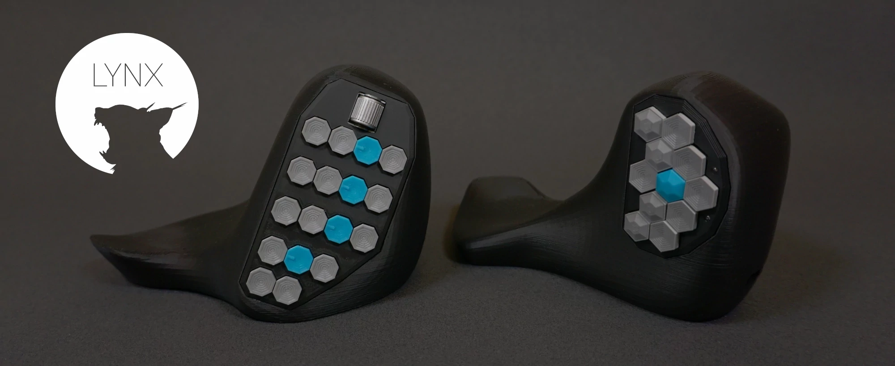
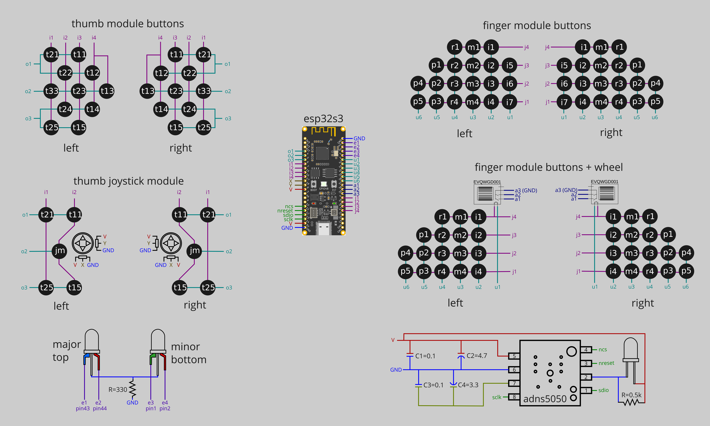

# The CAT project
The complete project documentation is at: https://www.lynxware.org/

The cat is a computer input device with different modules. Together with the software it's a versatile and flexible system that accommodates the individual needs of any user. LYNX aims to create equipment that enhances the workflow by reducing unnecessary movements. 

## Prerequisites
- Arduino IDE 2.1.0  
https://www.arduino.cc/en/software
- add the esp32 boards to the Arduino IDE  
https://espressif-docs.readthedocs-hosted.com/projects/arduino-esp32/en/latest/installing.html

## Circuit

